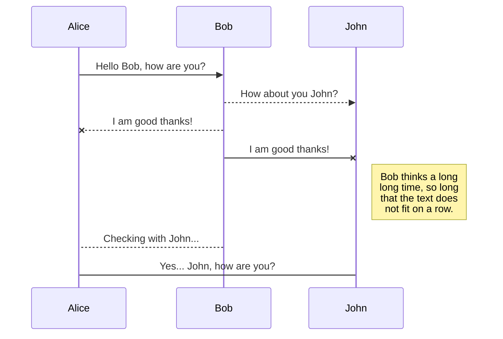

# Introduction

## What is site for?

This site is a resource, the purpose of which is to share interesting materials, my pratical tasks and ideas for projects and their implementation with other developers.

## About me

I'm Aleksandr Makarov - 3rd year student developer based in Finland. I mainly focus on backend development, but I also have experience in frontend development. Here is a set of technologies that I use to develop my projects:

- C# and ASP.NET Core
- Java and Spring
- React
- SQL and Databases

Since 2021 I have been studying backend application development and I still love it. I love developing projects from scratch and developing my skills in this field.

- [Resume](https://aleksandrmakarov-dev.github.io/my-cv/Resume.pdf)
- [LinkedIn](https://www.linkedin.com/in/aleksandr-makarov-397547252/)
- [Github](https://github.com/aleksandrmakarov-dev)

