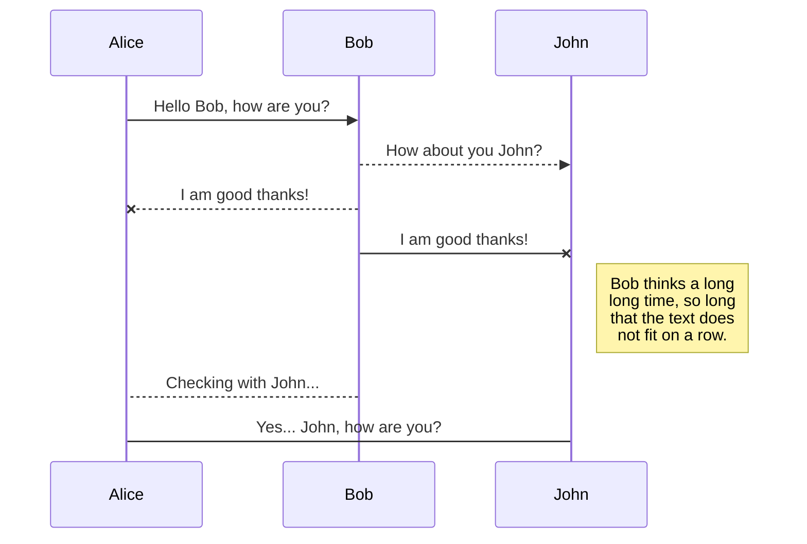

# Введение

## Для чего этот сайт?

Этот сайт представляет собой ресурс, цель которого поделиться интересными материалами, моими практическими задачами и идеями проектов и их реализации с другими разработчиками.

## Обо мне

Я Александр Макаров — студент 3 курса разработчика из Финляндии. В основном я занимаюсь backend-разработкой, но у меня также есть опыт frontend-разработки. Вот набор технологий, которые я использую для разработки своих проектов:

- C# and ASP.NET Core
- Java and Spring
- React
- SQL and Databases

С 2021 года я изучаю разработку серверных приложений и мне это до сих пор нравится. Мне нравится разрабатывать проекты с нуля и развивать свои навыки в этой области.

- [Резюме](https://aleksandrmakarov-dev.github.io/my-cv/Resume.pdf)
- [ЛинкдИн](https://www.linkedin.com/in/aleksandr-makarov-397547252/)
- [Гитхаб](https://github.com/aleksandrmakarov-dev)

