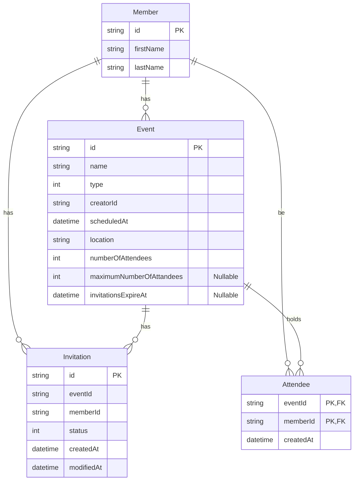

# Technical task "Event organizer"

```mermaid
erDiagram

Member {
  string id PK
  string firstName
  string lastName
}

Event {
  string id PK
  string name
  int type
  string creatorId
  datetime scheduledAt
  string location
  int numberOfAttendees
  int maximumNumberOfAttandees "Nullable"
  datetime invitationsExpireAt "Nullable"
}

Invitation {
  string id PK
  string eventId
  string memberId
  int status
  datetime createdAt
  datetime modifiedAt
}

Attendee {
  string eventId PK, FK
  string memberId PK, FK
  datetime createdAt
}

Member only one to zero or many Event : has
Member only one to zero or many Attendee : be
Member only one to zero or many Invitation : has
Event only one to zero or many Invitation : has
Event only one to zero or many Attendee : holds
```
