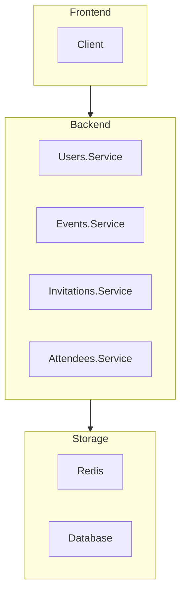

# Technical task "Event planner"

## Description

Event Planner - An application for event planners that can help in creating and sending email invitations, managing guests and tracking confirmations of participation. It allows guests to get information about the place and time of the event.

## Scheme

## Features

### Users

- User registration
- User authentication
- Email address verification
- Password recovery

### Events

- Create an event
- Edit an event
- Delete (cancel) an event
- Track the number of registered users
- Send notifications

### Invitation

- Request invitation
- Decline invitation
- Accept invitation
- Cancel invitation

### Attendee

- View attendences

## Entity Relationship Diagram

