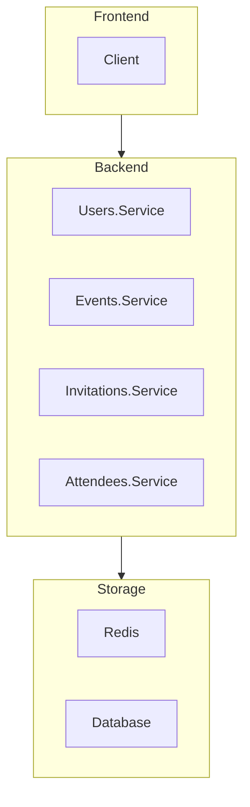

# Техническое задание "Планировщик мероприятий"

## Описание

Планировщик мероприятий - приложение для организаторов мероприятий которое может помочь в создании и рассылке электронных приглашений, управлении гостями и следить за подтверждением участия. Оно позволяет гостям получить информацию о месте и времений события.

## Схема

## Функционал

### Пользователи

- Регистрация пользователя
- Аутентикация пользователя
- Подтверждения почтового адреса
- Восстановление пароля

### События

- Создание события
- Редактирование события
- Удаление (отмена) события
- Отслеживания количества зарегистрировавщихся пользователей
- Рассылка уведомлений

### Приглашение

- Запрос приглашения
- Отклонение приглашения
- Принятие приглашения
- Отмена приглашения

### Участник

- ???

## Реляционная схема базы данных

